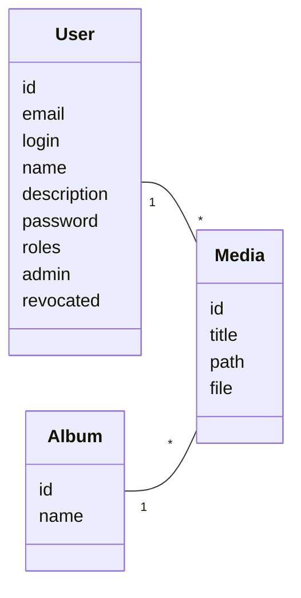

# Ina Zaoui - Site portfolio

## Description

Application Symfony du site de la photographe Ina Zaoui. Le site présente des
photos de paysages, une page invités et un espace d'administration permettant de
gérer les albums, les médias et les accès invités.

Le projet a été repris dans le cadre d'une mission de refactorisation : migration
Symfony, correction des uploads, passage des utilisateurs en base de données,
gestion des invités révoqués, tests automatisés, analyse statique et
documentation de passation.

## Sommaire

- [Prérequis](#prérequis)
- [Installation](#installation)
- [Accès de test](#accès-de-test)
- [Fonctionnalités](#fonctionnalités)
- [Utilisation](#utilisation)
- [Structure du projet](#structure-du-projet)
- [Tests et qualité](#tests-et-qualité)
- [Intégration continue](#intégration-continue)
- [Technologies utilisées](#technologies-utilisées)
- [Contribution](#contribution)
- [Licence](#licence)
- [Contexte et crédits](#contexte-et-crédits)
- [Notes de passation](#notes-de-passation)

## Prérequis

- PHP 8.4
- Composer
- Docker et Docker Compose
- PostgreSQL 16, fourni par `docker-compose.yml`
- Extensions PHP nécessaires au projet, dont `gd`, `ctype` et `iconv`

## Installation

### 1. Cloner et installer les dépendances

```bash
git clone https://github.com/Vivien60/Formation_OC_Symfony_P15_refacto_InaZaoui.git
cd Formation_OC_Symfony_P15_refacto_InaZaoui
composer install
```

Créez ensuite votre configuration locale si nécessaire :

```bash
cp .env .env.local
```

Le fichier `.env` contient des valeurs de développement. Ne stockez pas de secret
de production dans un fichier versionné.

### 2. Démarrer PostgreSQL

```bash
docker compose up -d --wait
```

Le service expose PostgreSQL sur le port `5432` avec l'utilisateur `postgres` et
le mot de passe `postgres`.

### 3. Créer la base de développement

Le projet fournit une cible Makefile qui crée la base, exécute les migrations,
importe les données de sauvegarde et réaligne les séquences PostgreSQL :

Les imports SQL utilisés sont dans `backup/` :

- `backup/user.sql`
- `backup/album.sql`
- `backup/media.sql`

Avant de lancer la commande ci-dessous, il convient de placer ce dossier à la racine du projet.

```bash
make db-create
```

### 4 Assets

Le projet utilise AssetMapper et Importmap. En environnement de production ou
pour générer les assets statiques :

```bash
php bin/console asset-map:compile
```

### 5. Lancer le site

En dev uniquement : avec le binaire Symfony :

```bash
symfony serve -d
```

Le site est ensuite accessible depuis `127.0.0.1:8000` ou `localhost:8000` en http ou https.

## Accès de test

Compte administrateur :

- identifiant : `ina@zaoui.com`
- mot de passe : `password`

Compte invité non-administrateur utilisé par les tests :

- identifiant : `marie@example.com`
- mot de passe : `password`

## Fonctionnalités

- Consultation des pages publiques du site : accueil, présentation, invités et portfolio.
- Affichage des invités actifs uniquement sur le Front Office.
- Authentification des administrateurs et invités depuis le formulaire de connexion.
- Gestion des albums depuis l'espace d'administration.
- Gestion des médias avec upload d'images et validation du poids maximal à 2 Mo.
- Association des médias à un album et à un utilisateur.
- Gestion des invités par Ina : consultation, révocation, restauration d'accès et suppression.
- Blocage de l'authentification des comptes révoqués.
- Suppression des fichiers médias associés lors des suppressions applicatives.

## Utilisation

### Front Office

- `/` : accueil
- `/about` : page de présentation
- `/guests` : liste des invités actifs
- `/guest/{id}` : détail d'un invité actif
- `/portfolio/{id}` : médias visibles publiquement pour un album donné

Les invités révoqués ne sont pas affichés sur les pages publiques, leurs photos non plus.

### Administration

- `/login` : authentification
- `/admin/album` : gestion des albums, réservée à Ina
- `/admin/guest` : gestion des invités, réservée à Ina
- `/admin/media` : gestion des médias

Les accès sont contrôlés dans `config/packages/security.yaml` :

- les routes `/admin/album` et `/admin/guest` demandent `ROLE_ADMIN` ;
- les routes `/admin/media` demandent `ROLE_USER` ;
- les autres routes sont publiques.

## Structure du projet

```text
src/
├── Command/        Commandes Symfony
├── Controller/     Contrôleurs Front Office et administration
├── Entity/         Entités Doctrine
├── Form/           Formulaires Symfony
├── Repository/     Repositories Doctrine
├── Security/       Vérification des comptes révoqués
├── Service/        Services applicatifs
└── Util/           Utilitaires techniques

templates/          Vues Twig
tests/              Tests PHPUnit fonctionnels et unitaires
```

### Modèle de données



### Choix d'implémentation

**Authentification**

Les utilisateurs sont chargés depuis la base via l'entité `User`. L'ancien
provider in-memory est conservé comme source de migration, puis recopié avec la
commande :

```bash
php bin/console app:migrate-inmemory-users
```

La commande dispose d'un mode sans persistance :

```bash
php bin/console app:migrate-inmemory-users --dry-run
```

**Révocation des invités**

La révocation est portée par l'entité `User` avec les méthodes `revocate()` et
`reinstate()`. Le `RevocationUserChecker` bloque l'authentification d'un compte
révoqué. Les services et contrôleurs publics ne remontent que les invités actifs
afin de masquer automatiquement leurs médias.

**Uploads**

L'entité `Media` porte la contrainte `Assert\Image` afin de refuser les fichiers
qui ne sont pas des images ou qui dépassent 2 Mo. Les fichiers sont stockés dans
le répertoire public configuré par `APP_PUBLIC_DIR`.

**Suppression des médias**

La suppression physique des fichiers est centralisée dans `MediaRemover`. Cela
évite de disperser la logique de suppression entre les contrôleurs média et
invité.

## Tests et qualité
### Descriptions des tests

Les tests fonctionnels vérifient les principaux parcours utilisateur :

- authentification réelle via le formulaire ;
- uploads et validations des médias ;
- gestion des médias ;
- révocation, restauration et suppression d'invités ;
- smoke tests sur les routes publiques et administrées.


### Préparer la base de test

**Tests**

Les tests fonctionnels vérifient les principaux parcours utilisateur :

- authentification réelle via le formulaire ;
- uploads et validations des médias ;
- gestion des médias ;
- révocation, restauration et suppression d'invités ;
- smoke tests sur les routes publiques et administrées.

```bash
make db-test
```

Cette cible démarre PostgreSQL, recrée la base `ina_zaoui_test`, exécute les
migrations, importe les données de test et réaligne les séquences.

### Lancer PHPUnit

Sans couverture :

```bash
php bin/phpunit --no-coverage
```

Avec la cible Makefile :

```bash
make test-no-coverage
```

Avec rapport de couverture :

```bash
php bin/phpunit
```

Le rapport HTML configuré par PHPUnit est généré dans `var/coverage/`. 

### Analyse statique et linters Symfony

```bash
php bin/console lint:yaml config
php bin/console lint:twig templates
php bin/console lint:container
php bin/console doctrine:schema:validate --skip-sync
vendor/bin/phpstan analyse -c phpstan.test.neon --no-progress
```

La cible Makefile suivante regroupe les linters Symfony :

```bash
make symfony-linters-execute
```

### Outils de maintenance

PHP-CS-Fixer :

```bash
vendor/bin/php-cs-fixer fix --dry-run --diff
```

Rector :

```bash
vendor/bin/rector process --dry-run
```

## Intégration continue

Le workflow GitHub Actions est défini dans `.github/workflows/symfony.yml`.
Il installe PHP 8.4, installe les dépendances, lance les linters Symfony,
prépare le cache nécessaire à PHPStan puis exécute l'analyse statique.

Une cible locale permet de tester ce workflow avec `act` :

```bash
make test-config-github-actions
```

## Technologies utilisées

- **Backend** : PHP 8.4, Symfony 7.4 (version LTS: Long Term Support)
- **Base de données** : PostgreSQL 16
- **ORM** : Doctrine ORM / Doctrine DBAL / Doctrine Migrations
- **Templates** : Twig
- **Formulaires et validation** : Symfony Form, Symfony Validator
- **Sécurité** : Symfony Security, entity user provider, user checker
- **Assets** : AssetMapper et Importmap
- **Tests** : 
  - PHPUnit : tests automatiques du code, à écrire. Détecte les erreurs à l'exécution/interprétation du code. Evite les régressions en signalant les échecs aux tests, peut permettre de valider que la fonctionnalité fait
  - BrowserKit : pour les tests fonctionnels. Simule grossièrement un navigateur.
  - DAMA Doctrine Test Bundle : permet de laisser la BDD de test à l'état d'origine une fois les tests effectués
- **Qualité**: 
  - PHPStan : analyse statique du code pour détecter les erreurs et smells, réputé, cycles de maintenance et d'évolutions très réguliers
  - PHP-CS-Fixer : analyseur statique. principalement sert à uniformiser le style du code pour la lisibilité, et détecte aussi quelques smells
  - Rector : application dez règles pour les montées de versions, et plus largement si on le souhaite, simplement pour refacorer. Beaucoup de rulesets prédéfinis.
- **CI**: GitHub Actions : permet d'assurer, en compléments des tests unitaires et fonctionnels, et des analyseurs statiques, qu'une mise à jour ne provoque ni erreur ni régression. Laisse le choix des outils à lancer.
- **Environnement local**: Docker Compose

## Notes de passation

- La base de données de développement dépend des exports SQL du
  dossier `backup/`.
- Les routes de suppression administratives utilisent des formulaires POST avec
  protection CSRF pour les médias et les invités.
- `APP_PUBLIC_DIR` permet de séparer les fichiers publics réels et les fichiers
  manipulés en environnement de test.
- Les comptes révoqués doivent être exclus des pages publiques et refusés à
  l'authentification.
- Les fichiers `.env.local`, `.env.test.local` et les secrets de production ne
  doivent pas être versionnés.

Ce projet est réalisé dans le cadre du parcours OpenClassrooms "Développeur
d'application PHP/Symfony".

## Contribution

Les règles de contribution sont décrites dans `CONTRIBUTING.md`.

Le principe attendu est de travailler depuis une branche dédiée, d'accompagner les
changements applicatifs par des tests adaptés, puis de vérifier les linters,
l'analyse statique et la suite PHPUnit avant de proposer une contribution.

## Licence

Projet propriétaire réalisé dans le cadre d'une formation OpenClassrooms.

## Contexte et crédits

Ce projet s'inscrit dans la mission OpenClassrooms "Refactorisez le code d'un
site pour l'optimiser". Le cas étudié est le site fictif d'Ina Zaoui,
photographe spécialisée dans les paysages.

Le travail porte sur la reprise d'un projet Symfony existant : migration du
framework, correction d'anomalies, ajout de fonctionnalités, tests, performance,
documentation et intégration continue.
